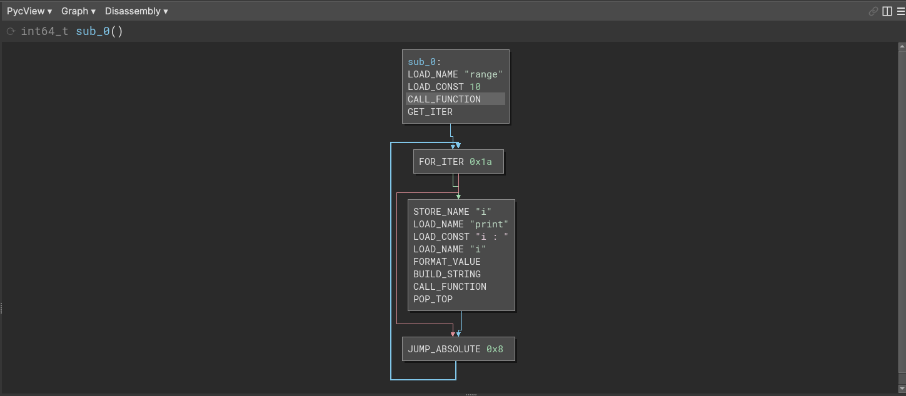

### BNPyc

<div align="center">
    Binary ninja plugin for python bytecode (pyc) disassembly and analysis.<br/><br/>
</div>

Python versions between 3.6.0 and 3.10 are supported, more to come!

## Installation

Clone this repository and install requirements :

<details>
    <summary>Linux</summary>
    
    git clone https://github.com/Njord0/BNPYC ~/.binaryninja/plugins/BNPyc
</details>

<details>
    <summary>Windows</summary>
    
    git clone https://github.com/Njord0/BNPYC %APPDATA%/Binary Ninja/plugins/BNPyc
</details>

<details>
    <summary>Darwin</summary>
    
    git clone https://github.com/Njord0/BNPYC ~/Library/Application Support/Binary Ninja/plugins/BNPyc
</details>

Then install requirements with pip :
```shell
cd BNPyc/
python3 -m pip install -r requirements.txt
```

## Usage

Choose any `.pyc` file and open it with binary ninja.



Example with a simple pyc file, doing a for loop and a print using a f-string.

## Features

- Recursive functions detections and analysis
- Convert to nop / Never branch / Invert branch patches
- Branchs annotations 
- co_consts / co_names / co_varnames annotations
- Comparisons annotations (COMPARE_OP)
- Objects mapping

## Screenshots


